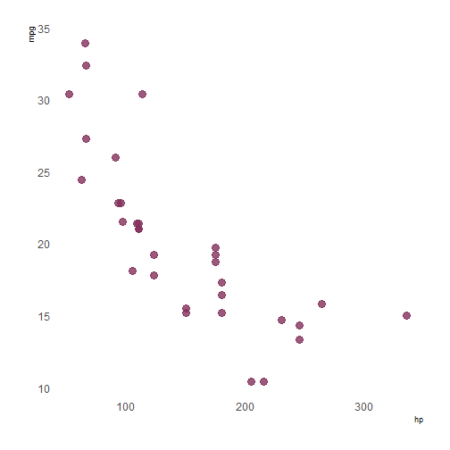
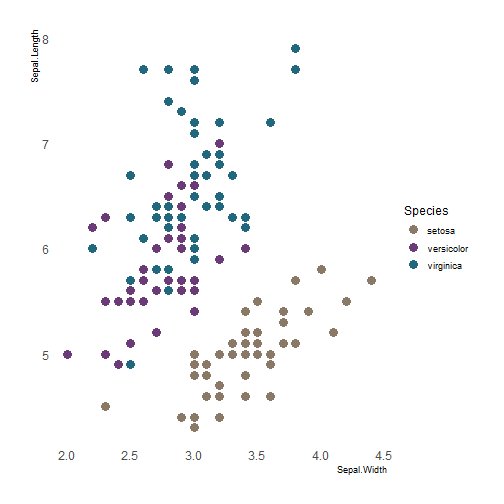
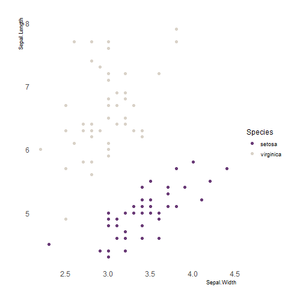
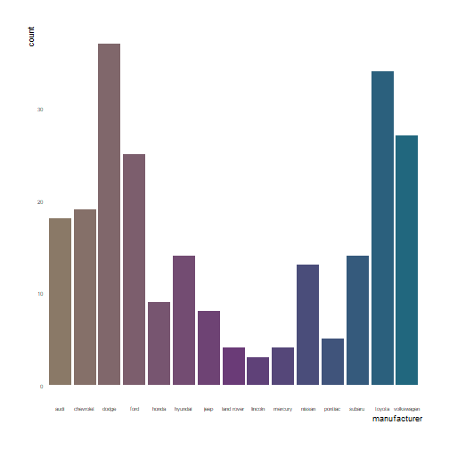
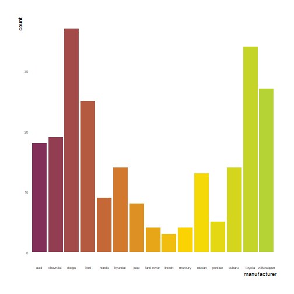
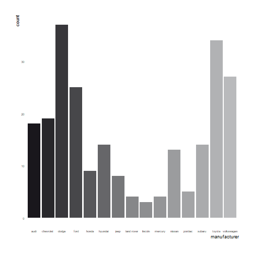

This R packages includes the [official MRC colour palette](https://mrc.ukri.org/about/information-standards/mrc-brand-guidelines/colour-palette/) spilt into primary and secondary. This package was created following [this](https://drsimonj.svbtle.com/creating-corporate-colour-palettes-for-ggplot2) example.

# Example usage of MRColour

```r
library(ggplot2)
library(MRColour)
library(hrbrthemes)

# Primary 
mrc_pal("primary")(3)
```

```
## [1] "#8A7967" "#6A3B77" "#21677E"
```

```r
mrc_pal("primary")(10)
```

```
##  [1] "#8A7967" "#826B6A" "#7B5D6E" "#744F71" "#6D4175" "#613F77" "#514979"
##  [8] "#41537A" "#315D7C" "#21677E"
```


```r
# Secondary
mrc_pal("secondary")(3)
```

```
## [1] "#822F5A" "#E7A618" "#B5D334"
```

```r
mrc_pal("secondary")(10)
```

```
##  [1] "#822F5A" "#9B454C" "#B55B3F" "#D07232" "#DF9421" "#EFB810" "#FFDB00"
##  [8] "#E6D811" "#CDD522" "#B5D334"
```


```r
# binary
mrc_pal("binary")(2)
```

```
## [1] "#6A3B77" "#D9D2C8"
```


```r
# greyscale
mrc_pal("greyscale")(3)
```

```
## [1] "#19171C" "#868789" "#B9BABC"
```

```r
mrc_pal("greyscale")(10)
```

```
##  [1] "#19171C" "#312F34" "#49484C" "#616164" "#797A7C" "#8B8C8E" "#97989A"
##  [8] "#A2A3A5" "#ADAEB0" "#B9BABC"
```


```r
# ggplot functions
ggplot(mtcars, aes(hp, mpg)) +
  geom_point(color = mrc_cols("red"),
             size = 4, alpha = .8) +
  theme_ipsum(grid=FALSE)
```




```r
ggplot(iris, aes(Sepal.Width, Sepal.Length, color = Species)) +
  geom_point(size = 4) +
  scale_color_mrc() +
  theme_ipsum(grid=FALSE)
```




```r
iris.sub <- iris %>%
  filter(Species != "versicolor")

ggplot(iris.sub, aes(Sepal.Width, Sepal.Length, color = Species)) +
  geom_point(size = 2) +
  scale_color_mrc(palette = "binary") +
  theme_ipsum(grid=FALSE)
```




```r
ggplot(mpg, aes(manufacturer, fill = manufacturer)) +
  geom_bar() +
  theme(axis.text.x = element_text(angle = 45, hjust = 1)) +
  scale_fill_mrc(palette = "primary", guide = "none") +
  theme_ipsum(grid=FALSE, axis_text_size = 6)
```




```r
ggplot(mpg, aes(manufacturer, fill = manufacturer)) +
  geom_bar() +
  theme(axis.text.x = element_text(angle = 45, hjust = 1)) +
  scale_fill_mrc(palette = "secondary", guide = "none") +
  theme_ipsum(grid=FALSE, axis_text_size = 6)
```




```r
ggplot(mpg, aes(manufacturer, fill = manufacturer)) +
  geom_bar() +
  theme(axis.text.x = element_text(angle = 45, hjust = 1)) +
  scale_fill_mrc(palette = "greyscale", guide = "none") +
  theme_ipsum(grid=FALSE, axis_text_size = 6)
```



